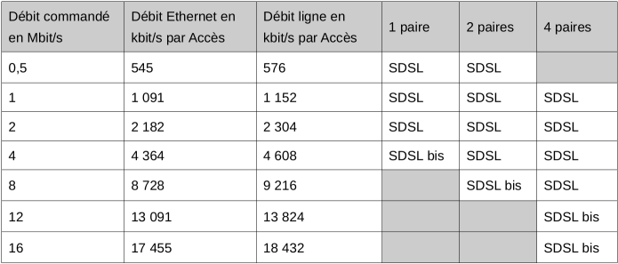
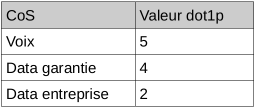
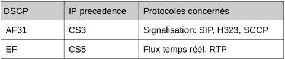

Accès sur liaison EFM
=====================

Paramétrages généraux
---------------------

VLAN à l’accès
~~~~~~~~~~~~~~

Les flux issus des Sites Extrémités sont transportés dans le VLAN
d'Accès jusqu'au DSLAM. La valeur du VLAN ID est fixée à 2900. Le
service ne permet qu’un niveau de VLAN correspondant au VLAN d’Accès. Le
VLAN d’Accès doit être positionné par l’équipement du Site Extrémité.

Nombre d'adresses MAC par Accès
~~~~~~~~~~~~~~~~~~~~~~~~~~~~~~~

Le nombre d'adresses MAC est limité à 3 par Accès.

Quand ce nombre d'adresses MAC est atteint, toute trame Ethernet émise
par le Site Extrémité avec une nouvelle adresse MAC source est
supprimée.

Établissement de session IP
~~~~~~~~~~~~~~~~~~~~~~~~~~~

L’utilisateur se connecte à la plate-forme de services de l’opérateur
grâce à l’établissement d’une unique session PPPoE entre le terminal
utilisateur et le point central d'aiguillage du réseau d’accès DSL ou
optique.

Accès SDSL EFM
--------------

Débits
~~~~~~

Le tableau ci-dessous précise les combinaisons possibles entre les
caractéristiques (débit commercial, nombre de paires) de l’Accès SDSL ou
SDSL bis ainsi que les débits Ethernet et débits ligne correspondants:

Les débits Ethernet sont donnés pour des trames Ethernet de 1500 octets.

La technologie SDSL est configurée avec la modulation PAM 16.

La technologie SDSL bis est configurée avec la modulation PAM 32 et
proposée pour un débit Ethernet > 2182 kbit/s par paire.

Interface de Service sans EAS
-----------------------------

L’Interface de Service est un simple connecteur avec interface physique
RJ 11 femelle. Dans le cas de la livraison d'un Accès sur une paire SDSL
ou SDLS bis, le service est délivré sur les broches 3 et 4.

Dans le cas de la livraison d'un Accès sur deux paires SDSL ou SDSL bis,
le service est délivré sur les broches 3 et 4 (paire 1) et sur les
broches 2 et 5 (paire 2).

Dans le cas de la livraison d'un Accès sur quatre paires SDSL ou SDSL
bis, le service est délivré sur deux connecteurs RJ11 : les broches 3 et
4 (paire 1) et les broches 2 et 5 (paire 2) sont connectées sur le
premier connecteur, et les broches 3 et 4 (paire 3) et les broches 2 et
5 (paire 4) sont connectées sur le deuxième connecteur.

Les broches 1, 2, 5 et 6 (cas Accès une paire) ou 1 et 6 (cas Accès deux
ou quatre paires) ne sont pas utilisées. Le câblage des broches d’une
paire est indifférencié.

Support de transmission et auto-négociation xDSL
~~~~~~~~~~~~~~~~~~~~~~~~~~~~~~~~~~~~~~~~~~~~~~~~

Les Accès des Sites Extrémités sont construits sur des DSLAM GE via un
support cuivre SDSL ou SDSL bis en 1,2 ou 4 paires avec technologie de
transmission EFM conforme à la norme 802.3ah et adopté par l'ITU-T G
998.2. Dans le cas de la livraison sur interface cuivre, TELECOM OBJECT
préconise l’activation de la fonctionnalité d'auto-négociation du type
de modulation sur l'interface xDSL.

Interface de service avec EAS
-----------------------------

L’EAS TELECOM OBJECT nécessite une alimentation électrique de 230 V AC
avec une puissance typiquement comprise entre 10W et 60W.

Le modèle sera communiqué sur demande.

L’interface de service est de type **Fast Ethernet (100BASE-TX) full
duplex**

Le type de connecteur à employer est **RJ45 (ISO 8877)**

Le câble à utiliser est du type **UTP 5**

Lors de la commande, l’utilisateur a la possibilité d’indiquer des
paramétrages spécifiques sur l’EAS qui sera livré.

Si aucune adresse de livraison n’est indiquée lors de la commande, le
matériel sera expédié à l’adresse de l’installateur privé, ou à défaut,
l’adresse de la commande l’Accès.

Accès optiques
--------------

Débits
~~~~~~

Les débits Ethernet sont donnés pour des trames Ethernet de 1500 octets.

Le débit est utilisable dans les 2 sens simultanément (descendant,
montant).

Tolérance aux pics de trafic
~~~~~~~~~~~~~~~~~~~~~~~~~~~~

L’ingénierie du service n’est pas prévue pour supporter les pics de
trafic (bursts).

En conséquence, la mise en oeuvre d’un mécanisme de « traffic shaping »
ou « traffic policing » est recommandée sur les équipements d'accès au
service)

Interface de service avec EAS
-----------------------------

L’EAS TELECOM OBJECT nécessite une alimentation électrique de 230 V AC
avec une puissance typiquement comprise entre 10W et 60W.

Le modèle sera communiqué sur demande.

L’interface de service est de type **Gigabit Ethernet (1000BASE-T)
compatible 100BASE-TX**

Le type de connecteur à employer est **RJ45 (ISO 8877)**

Le câble à utiliser est du type **UTP 6**

Lors de la commande, l’utilisateur a la possibilité d’indiquer des
paramétrages spécifiques sur l’EAS qui sera livré.

Si aucune adresse de livraison n’est indiquée lors de la commande, le
matériel sera expédié à l’adresse de l’installateur privé, ou à défaut,
l’adresse de la commande l’Accès.

Qualité de service
------------------

Classes de Service (CoS)
~~~~~~~~~~~~~~~~~~~~~~~~

Le Service permet de gérer la priorité de ses flux dans différentes
Classes de Service (CoS) parmi :

-  la **classe voix** pour les flux de type voix
-  la **classe data garantie** pour les flux de type data prioritaire et
   vidéo
-  la **classe data entreprise** pour les flux de type data entreprise
   non prioritaire

Les Classes de Service s’appliquent en cas de congestion au trafic entre
un Site Extrémité et l'Opérateur, et inversement.

Les **classes voix** et **data garantie** permettent d’écouler un flux
de données dont le débit est garanti à tout instant.

-  La **classe voix** utilise toute la bande passante nécessaire au bon
   écoulement de son trafic et est prioritaire par rapport à la **classe
   data garantie**.
-  La **classe data entreprise** permet d’écouler un flux de données
   dont le débit peut atteindre le débit d’Accès. Le transfert dans le
   réseau est effectué au débit d’Accès dans la mesure où l’état de
   charge du réseau le permet. Cette classe data entreprise est
   prioritaire sur la classe Best Effort attribuée aux flux internet
   Grand Public.

Marquage dot1p
~~~~~~~~~~~~~~

Afin de pouvoir différencier les Classes de Service en entrée de réseau,
les trames Ethernet échangées doivent être obligatoirement marquées
802.1p : Le champ dot1p peut prendre les valeurs suivantes:

Le marquage DSCP des paquets IP n’est pas modifié au niveau de l’Accès.

Marquage DSCP
~~~~~~~~~~~~~

Le coeur de réseau TELECOM OBJECT met en oeuvre une priorisation du
trafic basée sur le champs Differentiated Services Code Point (DSCP)
avec les valeurs suivantes:

Profils de Cos
--------------

Lors de la commande d’un Accès, le client précise le profil de CoS
associé parmi :

-  **mono cos data entreprise** : l’ensemble du trafic Opérateur en
   provenance ou à destination du dit accès est priorisé dans la Cos
   data entreprise.
-  **business** : profil permettant d’utiliser la CoS voix à hauteur de
   50% du débit d’Accès et la CoS data entreprise jusqu’au débit
   d’Accès. Le réseau TELECOM OBJECT supprimera le trafic voix au-delà
   du seuil de 50% affecté à la CoS voix. Pour les débits strictement
   supérieurs à 100Mb/s, les flux marqués avec la Cos voix sont limités
   à un débit de 100Mb/s. Le profil business n’est pas proposé sur les
   Accès optique sans EAS.
-  **mono cos data garantie** : l’ensemble du trafic Opérateur en
   provenance ou à destination du dit accès est priorisé dans la Cos
   data garantie.
-  **premium** : profil permettant d’utiliser les CoS voix, data
   garantie et data entreprise jusqu’au débit d’Accès pour les débits
   d’accès jusqu’à 100Mb/s. Pour les débits strictement supérieurs à
   100Mb/s, les flux marqués avec la Cos voix sont limités à un débit de
   100Mb/s. Le profil premium n’est pas proposé sur les Accès optique
   sans EAS au-delà de 100Mb/s.

